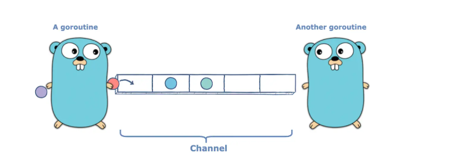

# Go Learning Notes - 2025-02-02

## What We Learned

Go is organized as follows:

* Module has many packages
* Package has many files

---------------------

* A file cannot be created without a package.
* **Format:**

    ```go
    package main

    import (
        // Import statements
        // ...
    )

    func main() {
        // Your code
    }
    ```

1.  `main` package is a special package. It tells Go that this is the entry point of your application.
2.  `main` method is very important because it is the method that executes when you run the project.
3.  **Build:** You need a `main` module to build it, and this will create an executable file that you can run on any machine.
4.  **Commands:**
    * `go mod init {name of module}`: Create module
    * `go build`: Create executable
    * `go run .`: Run executable

## Variable Declaration

* `var`, `const`
* **Format:**
    * `var variable Type = Value` (if you want to specify the type)
    * `variable := Value` (if you want the type of variable to be inferred)
* `fmt`:
    * `fmt.Print`
    * `fmt.Scan()`: You can pass references or pointers.

------------------

## How to Format Text Using the `fmt` Package

* We can use `Printf` and `Print`.
* Inside, we can use placeholders:
    * `%v`: For the value of the variable.
    * `%T`: For the type of the variable.

## Formatting Strings

* There is an `fmt` method called `Sprintf()`.
* You can format a string using this library.
* **Example:**

    ``` go
    greeting := fmt.Sprintf("Hello my name %v. I appreciate that all of you came today and promise it will be exceptional", name)
    ```
### Control Structures 
For loops are everything 
for is a while, for and can be used as infinite loop
```go
for :
for i:= 0 ; i< 10 ; i++ {
   fmt.printf("%.f", i) 
}

while : 
i: = 0;
for i <= 10{
    fmt.printf("%.f", i)
    i++ 
}

infinite loop 
for{
    break;
}
```
### Error Handling 
In GO, A method can return multiple things. 
Syntax
``` go
func divide(x, y int) (float64 , error){
    if(y == 0 ){
        return infinitie , errors.New("message")
    }

    return x / y, nil
}

quotient, err = divide(x,y)
if err !=  nil{
    fmt.print(quotient)
}else {
    return
}
```

### Why we use packages 
* We can organize the file int the same package. This is like just dividing you methods into different files. You dont need to import to use a method in other file 

* You can have different package. Then a package can be imported and used in different places and different projects u just need to import it. you dont import only name but the path that you should get go.mod
* Exported functions in go must be capital letter surprise mother fuckers

### Structs 
It is very similar to classes 
We use it to group related fields together and we can create method that will manipulate such data
####   How to create structs 
``` go
package main 
import (
    "time"
)
type User struct{
 firstName string
 lastName string 
 birthDate string
 age int 
 createdAt time.Time
}

func main(){
    // how to initialize a user using struct
    // we can use this when we dont know the order of attributes in struct
    user:=  User {
        firstName : "Moetaz",
        lastName : "Mohamed",
        birthDate : "20/02/2002,
        createdAt : time.Now(),
    }

    var user2 User =  User{
        "Moetaz",
        "Mohamed",
        "20/02/2002",
        20,
        time.Now(),

    } 

}
```

##### Methods for structs 
* In order to add a method to a struct, you need to pass this of the class refrence
* you can pass it as parameter but then you can call the method and pass the object 
* You can use a receiver. If u used this, you can call the method directly from the the object using the dot notation
```go
// method to update user 
func (*User u) UpdateUser(firstName, lastName string){
    u.firstName = "krnkrn"
    u.lastName = "nfri"
}
// if u passed User only it will not update the user that called the function because it will create a new one but here you are passing a pointer.
```
#### Encapsulation
* To encapsulate attributes in a struct you can make them small letters then you cant access them out of the file 
* To make them public make the attributes' first letter capital and then they are public

#### Constructors 
* To create a contructor, u need to create a function call New. This function should return the struct type. It might also return structType, error.
* We can add validation in the constructor 

```go
func New(firstName, lastName, birthDate string) User, nil{
if(firstName == "", lastName == "" , birthDate == ""){
    retrun nil , errors.New("User is invalid")
}

return User {
    firstName : firstName,
    lastName : lastName, 
    birthDate : birthDate,
}, nil
}
```

####   Expanding Structs
* The whole idea is that you can embed a struct inside a struct 
* To do this, u can just add one of the attributes as struct type make it public and you have acccess to the methods of the embeded struct 

## Arrays
### Initialization 
There are two different types of arrays in go 
* Slices 
* Fixed Size Array

Arrays are created in two different ways in Go
* Declare variable var variable_name [length]Type
* This array has a fixed size of 10 and size is unchangable 
```go
var arr [10]int
```
The other way of declaring an array is using :=
```go
strArr :=  [2]string {"Moetaz", "Mohamed"}
```
You can infer the size of the array from initialization if u used ellipses 
```go
arr := [...]string{"moetaz", "yasser"}
```
### Type if Arrays
Arrays are vaule type not a refrence type. This means that copying an array to another variable you create a copy of the array in a different memeory and you dont change the refrence of the array

#### 
Effects 
* Assigning a new variable to save array will create copy of the elements of the array 
``` go
arr := [2]int{1,2}
arr2 := arr
arr2[1] =100
fmt.Println(arr[1]) ==> 2
fmt.Println(arr2[2]) ==> 100
```

* Comparison between elements of array using == notation is valide 
``` go
arr := int[2]{1,2}
arr2 :=  int[2]{0,2}
fmt.Println(arr == arr2) ==> false 
arr2[0] = 1
fmt.Println(arr == arr2) ==> true
```
## Slices 
Biggest differece between array and slice is that a slice length can expand and shrink
### Inialization
* Variable Declaration 
``` go
var arr []int
```
* Assign Value 
``` go
arr = []int{1,2,3,4,4}
```
#### VIP
Slices are descriptors to arrays in go 
* Pointer to the begining of an array 
* length of an array 
* capacity of an array 


#### How this can affect our code
We can update any part of the array using slice and it will be so efficient because taking slice o(1)
``` go
arr := int[3]{1,2,3}
sliced := arr[1:3]
fmt.Println(sliced) // {2,3}
// the slicing is o(1) because slice saves pointer at index 1 and capacity and length are 2

```
* You can easily change any fixed array to a slice  
```go
var arr [5]int = [5]int{1,2,3,4,5}
arr2 := arr[:] // {1,2,3,4,5} with flexible size
```

* When changing any values in the sliced array will change the values in the original array because slice puts a pointer to the first index of element of sliced array

### Copying elements to create slices
* array has a fixed length, so when we slice it what will be the capacity of the slice? It will be the size of the original array from the starting element that u started slicing from
* length will be the number of elements you sliced
* what if you want to create a slice of bigger size and compy the elements u can use two methods make and copy 
```  go
arr:= [3]int{1,2,3}

sliced:= make([]int, 3 , len(arr)*2)
copy(sliced, arr)
fmt.Println(sliced) // 1,2,3
fmt.Println(cap(sliced)) // 6 
fmt.Println(len(sliced)) // 3
```
### Using slice as a list 
* append method can be used to append elements to the end of the slice. This will increase the size of the slice dynamically
* Vert similar to ArrayList in java and list in c# 
* This also provides us a new to copy fixed size array. We can expand and array and use append 
``` go
var fixedArr [3]int = []int{1,2,3}
var slicedArr []int;
append(slicedArr, ...fixedArr)
```

## Maps
### Initialization 
* Maps are key value pairs where keys are unique
``` go
var intMap map[int][int] = map[int][int]{}

strMap := map[string]string{}

strMap["hello"] = world
```
### Check if key exisit
* ususally we need to know if a key exist or not in map
``` go
intMap := map[int]int {}
intMap[0] =  1
val, exist := intMap[1]
if !exist {
    intMap[1] = 20
}  else {
    fmt.Println(val)
}
```

### Delete element from Map 
* There is a built in function to delete elements from a map 
``` go
floatMap :=  map[string]float64{}
floatMap["Moetaz"] =  1
delete(floatMap, "Moetaz")
```

### Loop over a Map 
``` go
var intMap := map[string]int{}
intMap[0] = "Moetaz"
intMap[1] = "Ahmed"

for ket, val := range intMap{
    fmt.Println(key, val)
}
```

## Functions Deep Dive
* We can treat functions as variables
* What defines a function is return type and parameter 
* After declaring  function variable with return type and set of parameter, the variable can have any function with signature stores in it. It is a pointer to a function
``` go
package main 
import("fmt")

func operationOnArray(arr []int, fn func(int) int){
    for i , val := range arr{
        arr[i] =  fn(val)
    }
}

func double(numb int) int {
    return numb * 2
}

func perfectSquare(numb int) int {
    return numb * numb
}

func main(){
    var arr := []int {1,2,3}

    operationOnArray(arr, double)
    operationOnArray(arr, perfectSquare)

}
```
## Go routines
### What is goroutines ?
Functions and Methods that run concurrently in a Go program
### Advantages of goroutines over threads 
* Threads depends on host computer operating system
* Go routines are cost effective and use fewer resources to function 
* Go routines do not use thread local storage
* It is a lightweight version of threads that operates within the context of the Go runtime

``` go
package main

func greet(){
    // has some logic
}

func main(){
    go greet() // this is a go routine (not a thread ==> light weight version of a thread)
    
}
```
### Key Concept
For go routine to execute the main function should be still running. If the main function is terminated then program is terminated the go run time doesnt exist then go routines are not executed 

* After go routine call, the program continues the next line of code and any return values from go routine is ignored
## Examples 
### Go routine that wont print in console
``` go 
package main 
import("main")
func greet (){
fmt.Println("hello ")
}
func main(){
go greet()
// when calling this nothing is printed in console because main method will return immediately after the go routine is called 
}
```
### Order of execution
``` go 
package main 
import (
    "fmt"
)
func greet (str string){
fmt.Println(str)
}
func main(){
    greet1 := "hello 1"
    greet2 := "hello 2"
    go greet(greet1)
    greet(greet2)

    time.sleep(1000)
    //output is 
    // hello 2
    // hello 1 
}
```
## Channels
### Definition

 Channel is a communication pipe between two go routines. The data gets in through one end and goes out in the same order from the other end untill the channel is closed
 ### How to create a channel
 * Create a variable for the channel 
 ``` go 
 var ch chan T
 // T is data type of value we want send and receive 
 ```
 * Setup the channel and allocate memory
 ``` go
 ch:= make(chan string)
 
 // initialize list with thr 
 ```
 ### Communication between channels
 * We can define a channel through which we send data and this data can be received in another go routine
 * go routine will be running concurrently and  the main go routine can execute as many lines of code as it can before waiting to receive data from the channel through <-ch
 * Through this we can achieve asynchronous programing
 ``` go 
package main 

import("fmt")

func fetchUserData(ch chan <- []string){
    // api to fetch data
    names := []string {"moetaz","mohamed", "yasser"}
    ch <- names
}
func main(){
    ch := make(chan []string)
    go fetchUserData(ch)
    fmt.Println("Here we can do anything we want ")
    data := <-ch
    fmt.Println(data)
}

 ```

 ### Closing Channel
 * After you finish receiving data you can just close the channel 
 ``` go 
 close(ch)
 ```
 ``` go
for val  := range ch {
    fmt.Println(val)
} 
 ```


